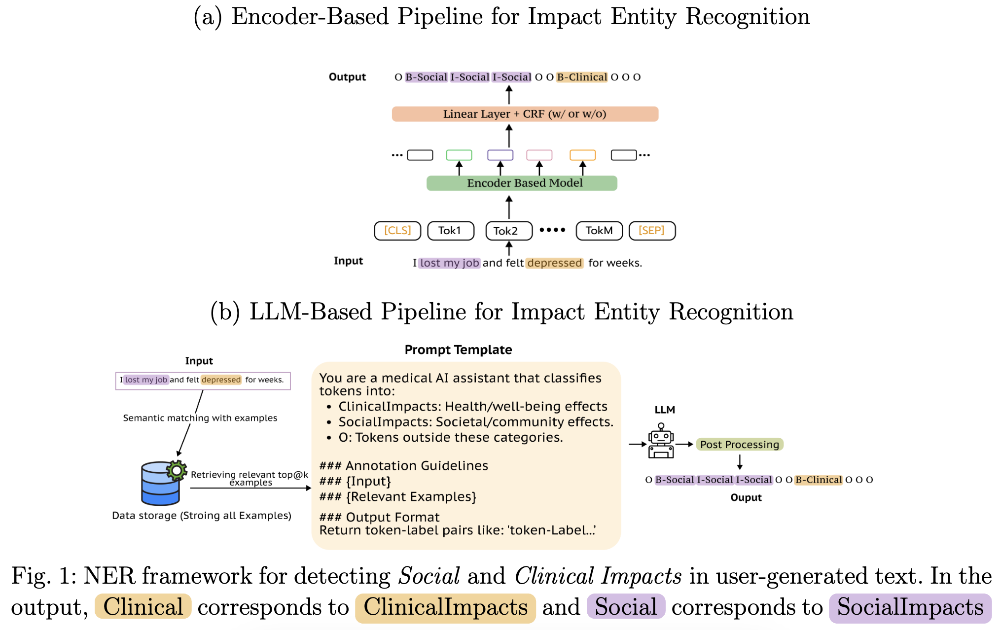
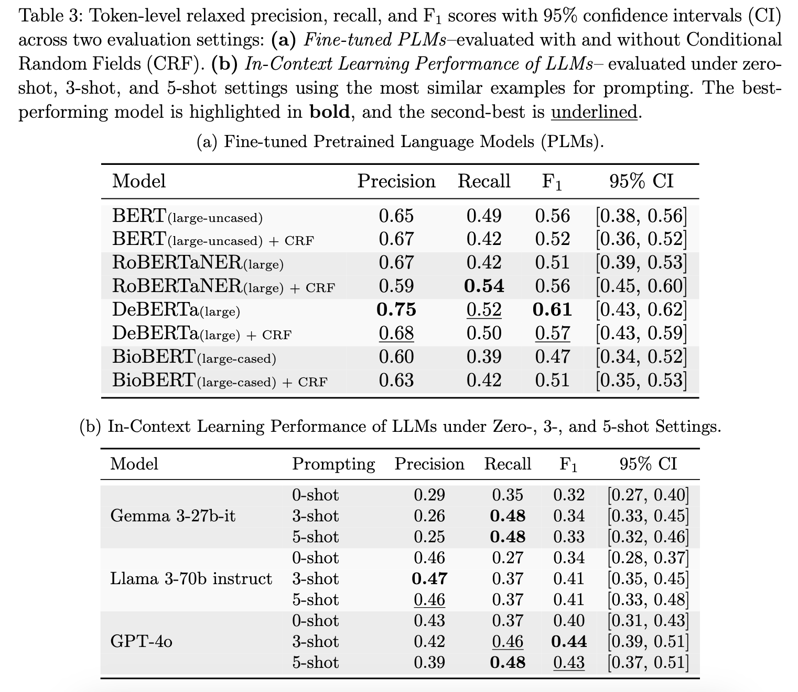
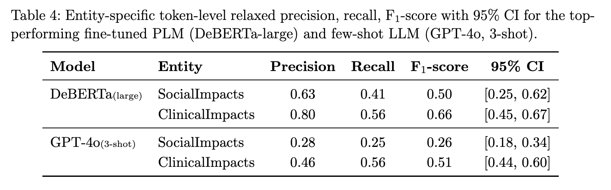

### [Inference Gap in Domain Expertise and Machine Intelligence in Named Entity Recognition: Creation of and Insights from a Substance Use-related Dataset](https://arxiv.org/pdf/2508.19467)

This repository contains the code and supplementary materials for the paper. It will be updated with more reproducible resources, such as models, training scripts, and more. The paper has been accepted for oral presentation and publication in the Proceedings of the [Pacific Symposium on Biocomputing (PSB) 2026](https://psb.stanford.edu/). 

### Folder structure ###
- `./new_data` - Contains all dataset-related files.
- `./results` - Stores evaluation results generated from the test dataset.
- `./notebooks` - Includes notebooks for data preprocessing and exploration.
- `./src` - Contains source code for Named Entity Recognition (NER) using LLMs and PLMs.

### Code usage instructions ### 
First, clone this repo and move to the directory. Then, install the necessary libraries. Also, the following commands can be used:
```bash
$ git clone https://github.com/SumonKantiDey/Reddit_Impacts_NER.git
$ cd Reddit_Impacts_NER/ 
$ pip install -r requirements.txt
```

### Copy the example environment file ###
```
$ cp .env.example .env
```
### Model Training and Inference ### 
Train and evaluate **PLM-based** models across multiple random seeds using the following scripts:
```bash
# Train and evaluate PLM model
src/train_plm.sh
# Train and evaluate PLM + CRF model
src/train_plm_crf.sh
```
####  These scripts will:
- Train the model using different seeds
- Evaluate on the test dataset
- Compute confidence intervals


> ✨ **Tip:** You can modify parameters (e.g., model name, GPU ID) directly within the script files.

### Few-shot Inference with LLMs ### 
Few-shot prompting using several large language models. Run the desired script from below:
```bash
# Few-shot inference script
python -m src.few_shot_gpt4
python -m src.few_shot_llama
python -m src.few_shot_gemma

# Post-process results based on LLM outputs
python -m src.few_shot_post_processing

# Compute confidence intervals 
python -m src.confidence_interval
```
These scripts will:
- Perform NER via in-context learning with few-shot examples
- Generate and post-process predictions from selected LLM

> ⚠️ Make sure you have appropriate API keys stored in the ```.env``` file or have a local setup for each LLM.

### Methods ###
<p align="center"></p>
 
### Dataset ###
The dataset will be made available upon reasonable request, subject to any necessary data-use agreements.

### Results ###
<p align="center"></p>

<p align="center"></p>


## 🔗 Paper & Citation
If you use the code of this repository in your research, please cite our paper:

```bibtex
@article{dey2025inference,
  title={Inference Gap in Domain Expertise and Machine Intelligence in Named Entity Recognition: Creation of and Insights from a Substance Use-related Dataset},
  author={Dey, Sumon Kanti and Powell, Jeanne M and Ismail, Azra and Perrone, Jeanmarie and Sarker, Abeed},
  journal={arXiv preprint arXiv:2508.19467},
  year={2025}
}
